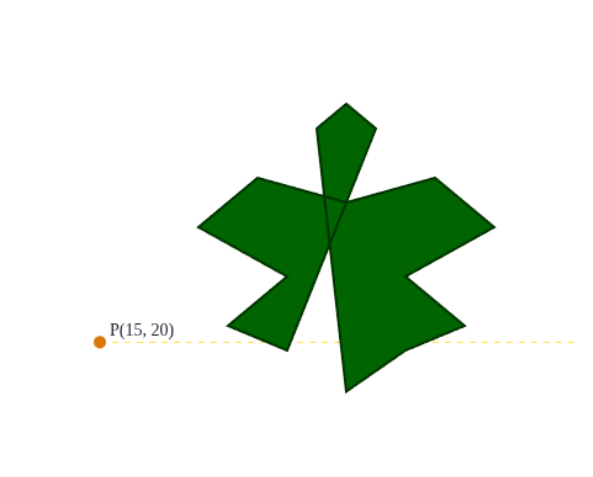

# A point in polygon

Question: Give a point and a polygon in the plane. Is the point inside, outside, or on the boundary of a polygon

Input: 
    
- point: (x,y); x,y: int
- polygon: []point

Output: boolean

Case1:

Polygon: `[{"x": 40, "y": 14},{"x": 46, "y": 19},{"x": 52, "y": 22},{"x": 46, "y": 28},{"x": 55, "y": 34},{"x": 49, "y": 40},{"x": 40, "y": 37},{"x": 31, "y": 40},{"x": 25, "y": 34},{"x": 34, "y": 28},{"x": 28, "y": 22},{"x": 34, "y": 19},{"x": 43, "y": 46},{"x": 40, "y": 49},{"x": 37, "y": 46}]`

Point: `{"x": 15, "y": 20}`
